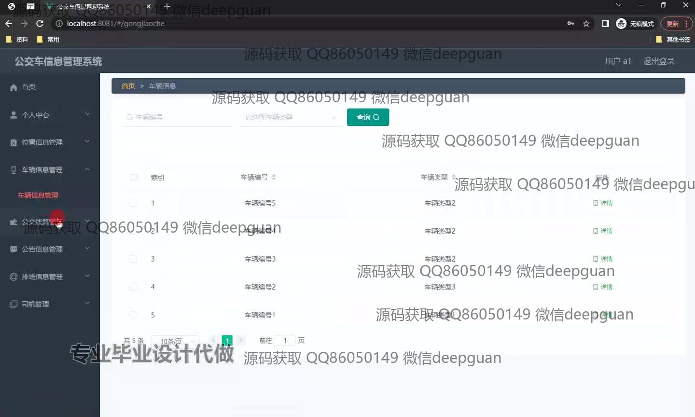
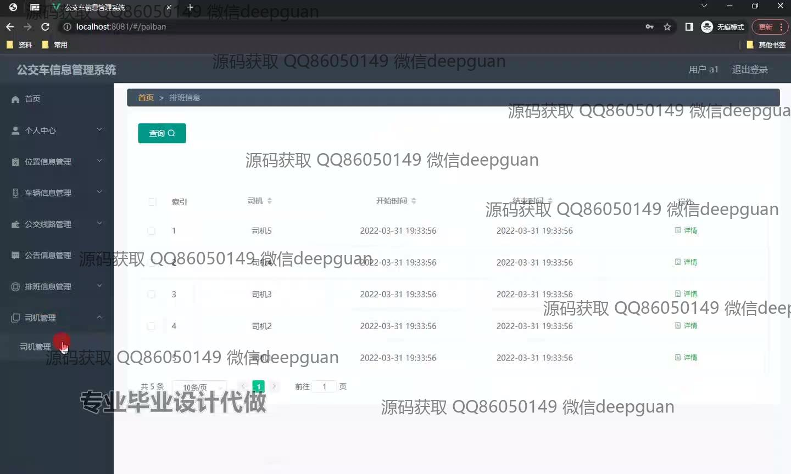
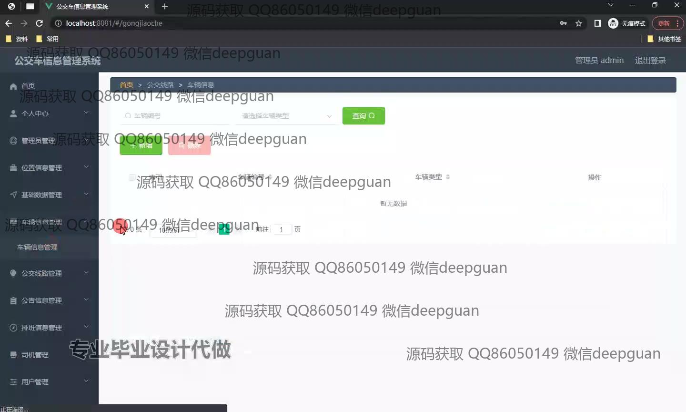
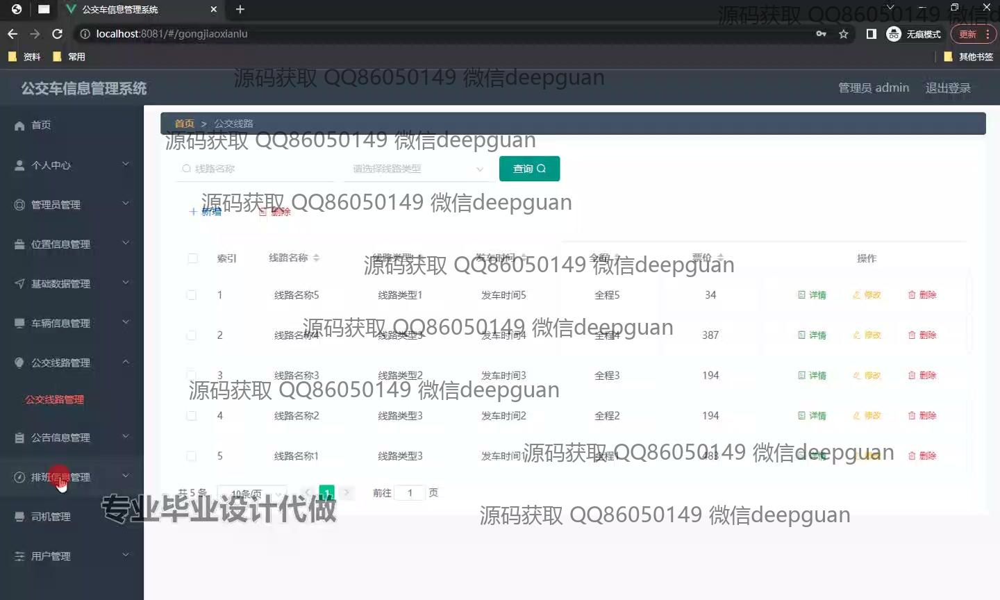

<h1 align="center">公交车信息管理系统+vue</h1>

## 简介
公交车信息管理系统：角色分为管理员、用户；车辆信息管理、线路信息管理、司机管理、个人中心、位置管理、排班信息管理。支持筛选、查询、新建和删除操作，界面简洁，功能模块化。    --计算机毕业设计源码；毕设源码；java毕业设计源码

## 联系方式

<h3 align="center">获取完整代码与数据库文件 + 微信：deepguan QQ: 86050149 QQ群: 783742310</h3>

<h3 align="center">可帮忙远程部署 包运行成功！提供远程部署、修改代码、设计文档指导、代码讲解等服务！</h3>

## 功能介绍（完整见运行截图）
管理员：负责管理车辆、司机、线路及用户信息，包括系统登录、注册、退出，个人信息查看与修改。功能模块化，涵盖车辆信息管理、公交线路管理、司机排班管理及用户权限管理等。支持增删改查、筛选查询及分页操作。顶部显示管理员信息，提供快速退出功能。

司机：可通过系统查看个人排班信息，包括开始时间和结束时间等，支持按条件查询具体任务。司机管理模块直观，操作简单，便于查看与管理个人工作安排。

用户：可通过系统查看公交车和线路相关信息，支持根据线路类型或发车时间等条件查询所需数据，浏览详细线路和票价信息。系统支持快捷登录，便于用户快速获取实时公交信息。

乘客：通过前端界面获取公交车位置、排班及票价等信息，支持实时查询和按条件筛选线路。交互简单直观，帮助乘客快速规划出行方案，提高出行便利性。

## 运行截图

本代码来源于网络,仅供学习参考使用!

